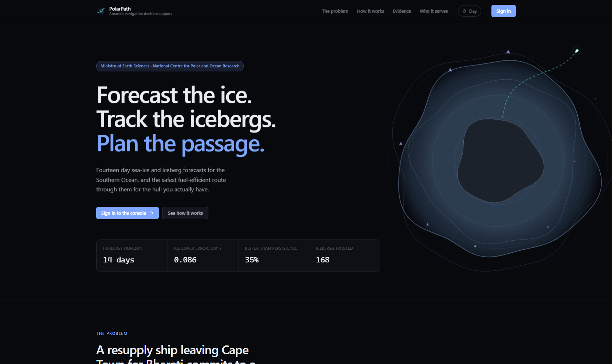
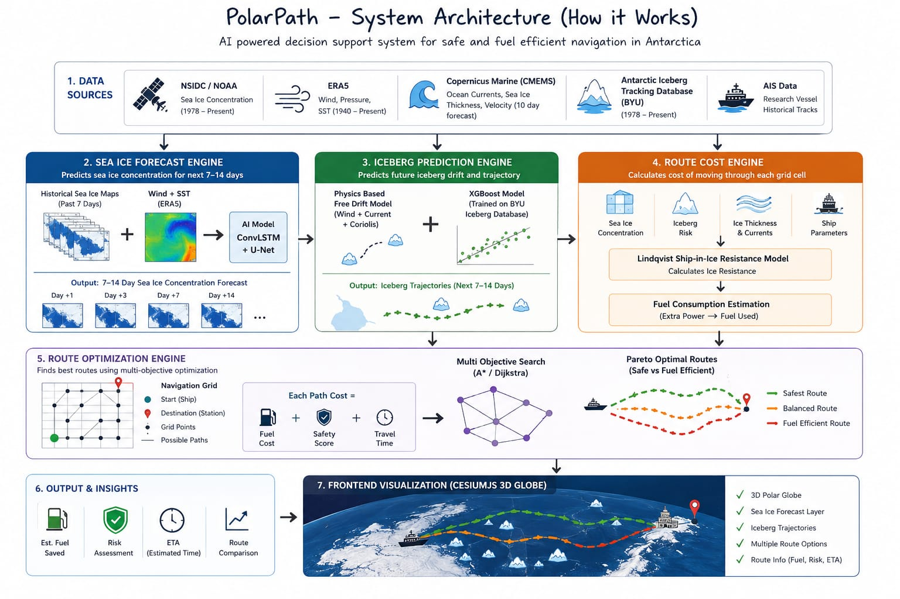
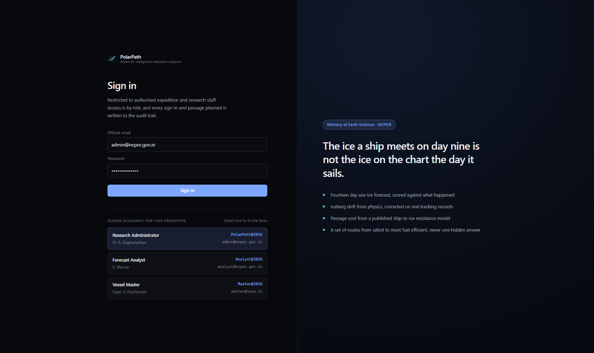
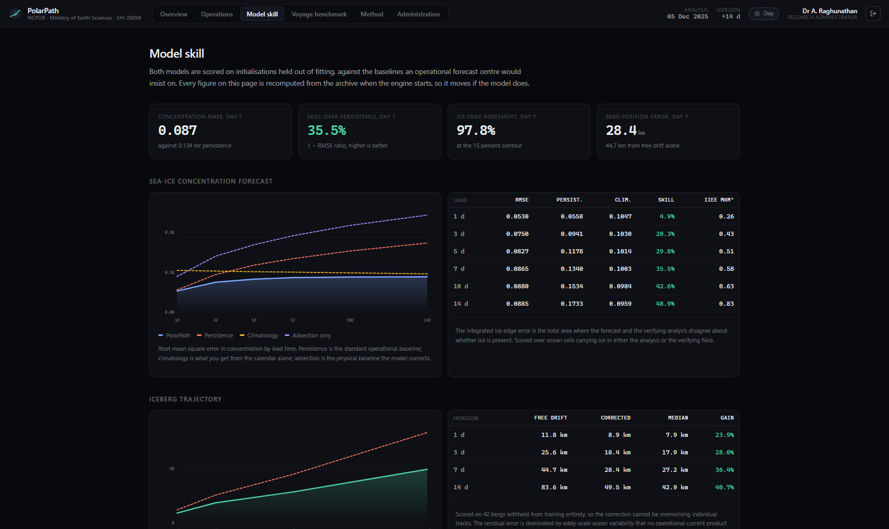
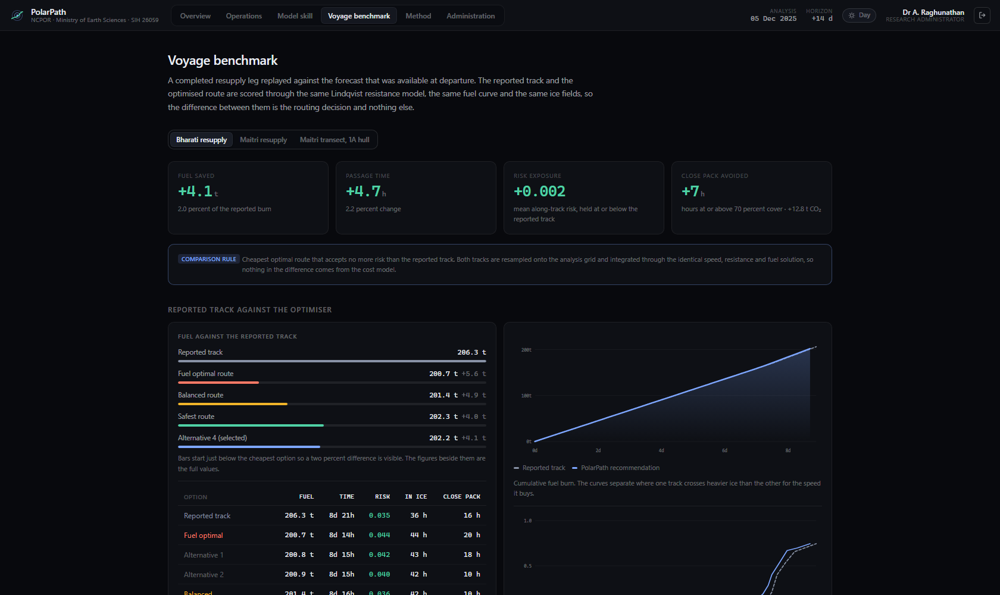
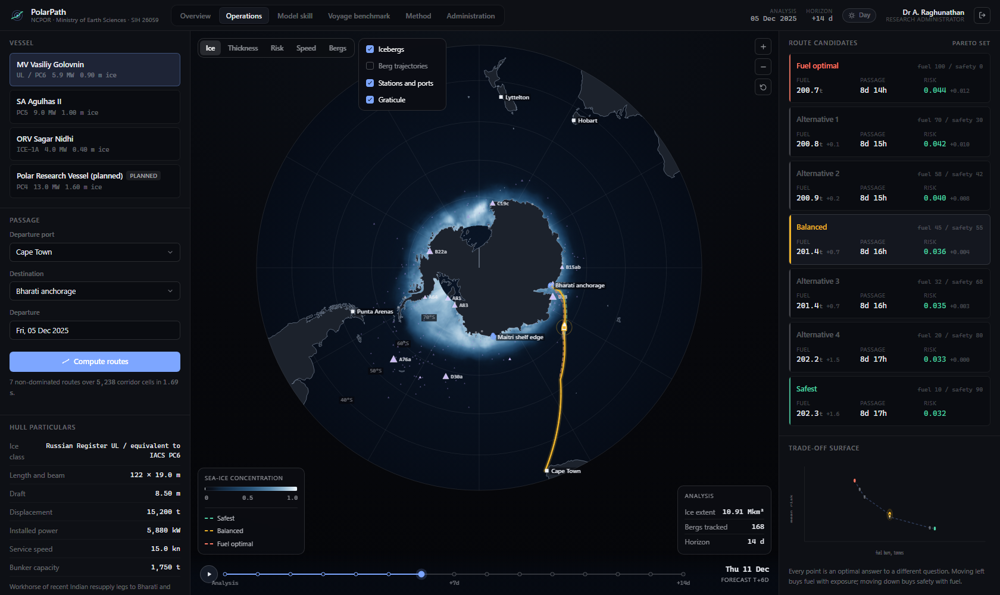
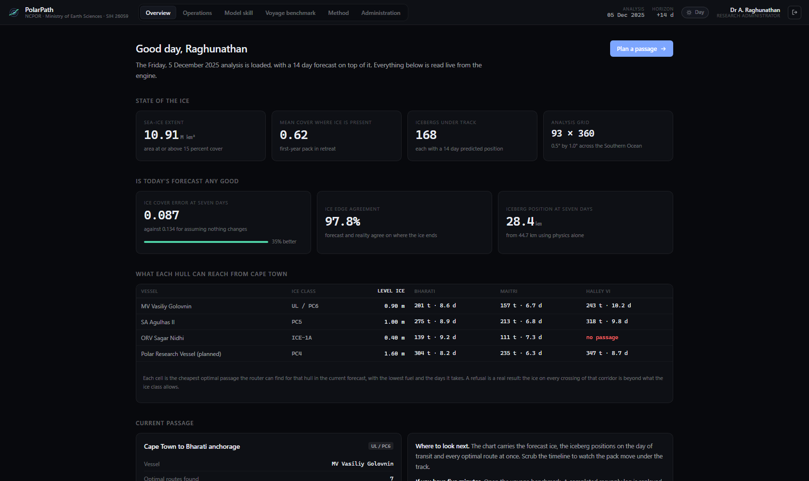
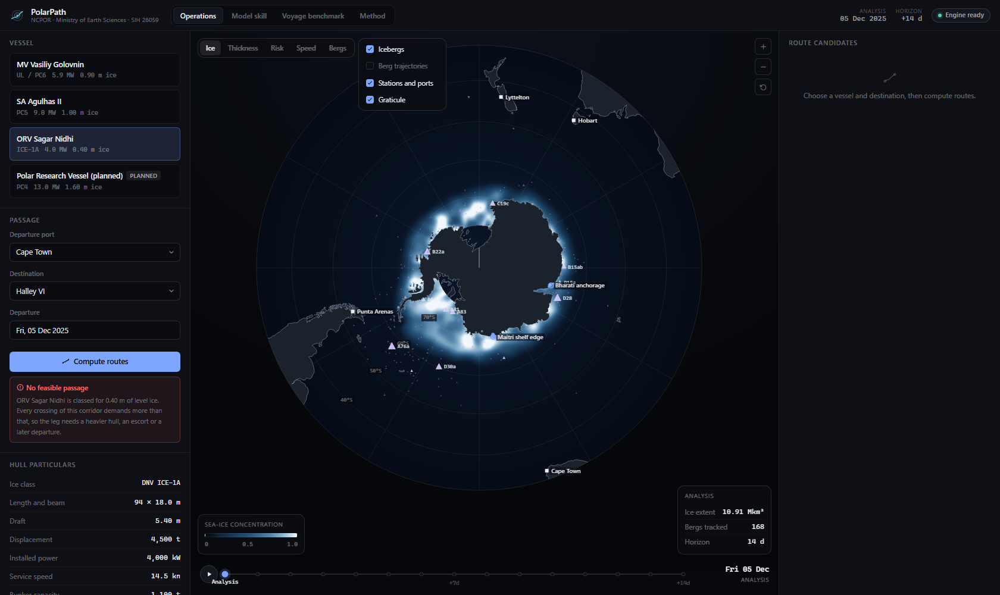
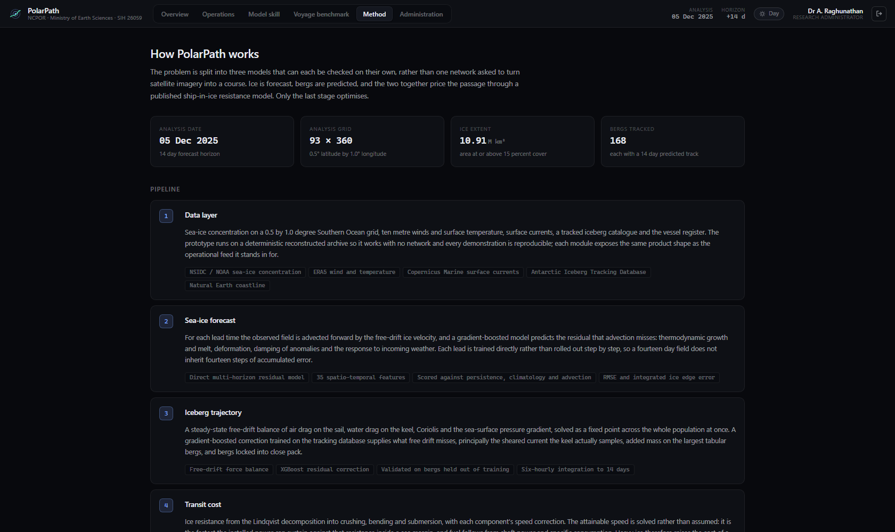
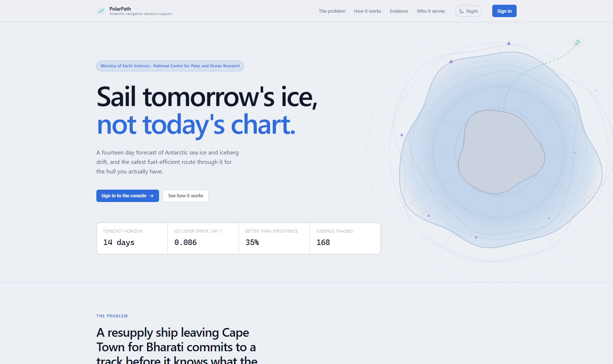

<div align="center">



# PolarPath

**AI-Enabled Antarctic Sea-Ice, Iceberg Trajectory and Navigation Decision Support System**

Forecast the ice. Track the icebergs. Plan the passage.

[](https://sih.gov.in/sih2026PS)
[](https://moes.gov.in/)
[](https://ncpor.res.in/)
[](https://sih.gov.in/sih2026PS)
[](https://python.org)
[](https://react.dev)
[](#quick-start)
[](#deploying)

### [Open the live deployment](https://polarpath-sih.vercel.app)

Sign in with `admin@ncpor.gov.in` and `PolarPath@2026`, or use
[this link](https://polarpath-sih.vercel.app/signin?as=administrator) to go straight in.

Built by **Team PolarPath** for Smart India Hackathon 2026

</div>

---

## Contents

| | | |
| :-- | :-- | :-- |
| [Live deployment](#live-deployment) | [The problem](#the-problem) | [What it does](#what-it-does) |
| [Quick start](#quick-start) | [Signing in](#signing-in) | [How it works](#how-it-works) |
| [Results](#results) | [The voyage benchmark](#the-voyage-benchmark) | [Interface](#interface) |
| [Repository layout](#repository-layout) | | |
| [Technology](#technology) | [API](#api) | [Deploying](#deploying) |
| [Scope](#scope-and-what-we-are-not-claiming) | | |
| [Team](#team) | [References](#references) | [Licence](#licence) |

---

## Live deployment

**[https://polarpath-sih.vercel.app](https://polarpath-sih.vercel.app)**

The whole system runs there: the forecast cycle, the iceberg trajectories, the
route optimiser and the audit trail. Nothing is a mock-up and nothing is a
screenshot.

| Try | Link |
| :-- | :-- |
| The public page | [https://polarpath-sih.vercel.app](https://polarpath-sih.vercel.app) |
| Straight in as the administrator | [https://polarpath-sih.vercel.app/signin?as=administrator](https://polarpath-sih.vercel.app/signin?as=administrator) |
| Straight in as a vessel master, three views only | [https://polarpath-sih.vercel.app/signin?as=master](https://polarpath-sih.vercel.app/signin?as=master) |
| Engine health | [https://polarpath-sih.vercel.app/api/health](https://polarpath-sih.vercel.app/api/health) |

Measured against the running deployment rather than a local machine:

| Endpoint | Warm response |
| :-- | --: |
| Landing page, sign in, console | under 0.4 s |
| Raster layer, 33,480 cells | 0.3 s |
| Route with the full ten-weighting Pareto sweep | 1.3 s |
| Largest search graph, Cape Town to McMurdo, 10,097 cells | 3.6 s |
| Voyage benchmark, the heaviest endpoint | 3.1 s |

Serverless functions sleep when idle, so the first request after a quiet period
pays a wake-up. Open the link a minute before demonstrating it.

One behaviour differs from a local run by design: the audit trail lives in
memory, so each function instance keeps its own. Everything done in a single
session is recorded, but the list does not accumulate across instances the way
it does in one long-lived process. In production that trail belongs in a
database.

---

## The problem

> **SIH 2026, Problem Statement 26059.** Develop an AI/ML-enabled decision support platform capable
> of forecasting Antarctic sea-ice concentration, predicting iceberg trajectories, and identifying
> safe and fuel-efficient navigation routes for research vessels using satellite, oceanographic and
> meteorological datasets.
>
> Ministry of Earth Sciences, National Centre for Polar and Ocean Research.
> Theme: Transportation and Logistics.

A resupply ship leaving Cape Town for Bharati commits to a track before it knows what the ice will
do. Three things follow from that.

| | |
| :-- | :-- |
| **The ice moves faster than the plan** | Antarctic pack ice can shift a hundred kilometres in a week. A track chosen from today's chart can meet a very different ice edge by the time the ship gets there. |
| **Fuel is the second casualty** | Pushing through heavy ice does not just slow a ship down. It raises the burn per kilometre at the same time, so the cost of a bad crossing compounds. |
| **Besetting is the first** | A hull stopped in close pack far from open water is a rescue problem, not a delay. Knowing a passage is beyond a vessel's ice class matters more than any saving. |

---

## What it does

PolarPath forecasts sea-ice concentration and iceberg drift across the Southern Ocean, prices every
possible passage through a published ship-in-ice resistance model, and returns a set of routes from
safest to most fuel efficient. It also refuses a passage when the hull cannot make it.

The problem is deliberately **not** handed to one network. It is split into three models that can
each be validated on their own, and only the last stage optimises.

<div align="center">



</div>

---

## Quick start

**Requirements:** Python 3.11 or later, Node 18 or later. No network access is needed at any point.

```bash
pip install -r backend/requirements.txt
```

**Windows**

```powershell
.\run.ps1              # builds the interface and serves everything on http://127.0.0.1:8000
.\run.ps1 -Dev         # API on :8000, Vite dev server on :5173
```

**macOS and Linux**

```bash
./run.sh
./run.sh --dev
```

Then open **http://127.0.0.1:8000**.

The first launch trains both models and builds the forecast cycle, which takes a few minutes.
Everything is then cached under `backend/data/`, so later starts take about ten seconds. To rebuild
the artefacts from scratch and print the full validation report:

```bash
python backend/scripts/train.py
```

---

## Signing in

The landing page is public. The console is not. Three accounts are seeded, and they are listed on
the sign-in screen itself so nobody has to read the source to get in.

| Account | Password | Role | What it opens |
| :-- | :-- | :-- | :-- |
| `admin@ncpor.gov.in` | `PolarPath@2026` | Research Administrator | Everything, including the user register and the audit trail |
| `analyst@ncpor.gov.in` | `Analyst@2026` | Forecast Analyst | Everything except administration |
| `master@isea.in` | `Master@2026` | Vessel Master | Overview, Operations and Method only |

`http://127.0.0.1:8000/signin?as=administrator` signs straight in. Swap `administrator` for
`analyst` or `master`.

**The authentication is real, not decorative.** Passwords are stored as PBKDF2-SHA256 digests with
a per-user salt, never in clear. Sessions are HMAC-signed tokens that carry their own expiry, so no
session table is kept and a token that leaks stops working on its own. Roles gate the API, not only
the menu: a Vessel Master token is refused by `/api/admin/users` with a 403. Every sign-in and every
passage planned or refused is written to an audit trail the administrator can read.

<div align="center">



</div>

---

## How it works

### 1. Data layer

Sea-ice concentration on a 0.5 degree latitude by 1.0 degree longitude Southern Ocean grid, which
is 93 by 360 cells and close to square at 60 S. Ten metre winds and surface temperature, surface
currents, a tracked iceberg catalogue, the coastline, and the vessel register.

| Module | Stands in for |
| :-- | :-- |
| `datasets/sea_ice.py` | NSIDC and NOAA passive-microwave concentration |
| `datasets/reanalysis.py` | ERA5 winds and temperature, Copernicus Marine surface currents |
| `datasets/icebergs.py` | Antarctic Iceberg Tracking Database (BYU) and National Ice Center bergs |
| `datasets/ocean_atlas.py` | Natural Earth 1:50m coastline. This one is the real data, unmodified |

The reanalysis is reconstructed from published first-order structure: a zonal pressure profile with
the subtropical ridge near 32 S and the circumpolar trough near 65 S, a train of eastward
propagating synoptic lows plus the Amundsen Sea Low, geostrophic winds with a boundary-layer
turning angle, and a non-divergent surface current from a streamfunction combining the Antarctic
Circumpolar Current, the coastal easterly current and the Weddell and Ross gyres.

Sea ice is a climatological edge interpolated round the continent from sector maxima and minima
with an asymmetric seasonal cycle, plus a synoptic anomaly that is advected by the ice velocity,
damped on a one-week timescale and re-forced daily. That anomaly is what makes forecasting a real
problem rather than a lookup.

### 2. Sea-ice forecast

A **direct multi-horizon residual model**. For lead time L the baseline is the observed field
advected forward L days by the free-drift ice velocity, and a gradient-boosted regressor predicts
the correction advection misses:

```
SIC(t + L) = advect(SIC(t), L) + f(features(t, L))
```

Thirty-five features cover lagged concentration, tendencies, neighbourhood structure, the anomaly
against climatology, the advection baseline, wind and its component across the ice edge,
temperature, freezing degrees, drift convergence and geography.

Each lead is trained **directly** rather than rolled out recursively, so a fourteen-day field does
not inherit fourteen steps of accumulated error.

### 3. Iceberg trajectory

A steady-state free-drift force balance:

```
0 = F_air + F_water + F_ice + F_coriolis + F_pressure
```

Quadratic drag on the sail and keel areas, a Coriolis term turning the berg to the left in the
southern hemisphere, and the pressure gradient written through the geostrophic balance of the
current so a berg with no wind on it simply follows the water. Rearranging the water-drag term
gives a fixed point that converges in a few tens of iterations and vectorises across the whole
population at once.

Free drift has known biases, so an **XGBoost residual correction** trained on the tracking database
supplies what it misses: the sheared current a deep keel actually samples, added mass on the
largest tabular bergs, and bergs locked into close pack moving with the ice rather than through it.

### 4. Transit cost

Ice resistance from the **Lindqvist (1989)** decomposition into crushing, bending and submersion,
each with its own speed correction:

```
R_ice(V) = (R_C + R_B)(1 + 1.4 V / sqrt(g h)) + R_S(1 + 9.4 V / sqrt(g L))
```

The attainable speed is **solved, not assumed**. It is the fastest speed whose shaft power fits
inside the installed power with a 15 percent sea margin, found by bisection and vectorised over the
grid. Fuel follows from shaft power and specific consumption, including the hotel load. Heavy ice
therefore raises the cost of a cell twice over, through a slower transit and a higher burn.

A hull is refused a cell when the effective ice load, thickness weighted by cover, exceeds what its
class allows. ORV Sagar Nidhi at ICE-1A reaches Bharati and Maitri but genuinely cannot make Halley
VI or Belgrano II through the Weddell pack in December, and the interface says so rather than
drawing a line the ship cannot sail.

### 5. Route optimisation

A 16-connected lattice restricted to an ellipse around the direct track, searched with A star on a
cost blending fuel, passage time and a four-part risk index. Three properties matter:

- **Cost comes from the physics**, not from a penalty invented for ice concentration.
- **The graph is time dependent.** Each label carries the hour of arrival, so the ice field and berg
  positions used to price the next leg are the forecast valid when the vessel actually gets there.
- **The answer is a Pareto set.** The search is repeated across ten fuel-versus-safety weightings,
  dominated outcomes are discarded, and the master keeps the trade-off instead of being handed a
  hidden compromise.

The risk index is kept in four separately weighted parts so any number can be explained:

| Weight | Term | What it measures |
| --: | :-- | :-- |
| 40% | Ice severity | Concentration above the 15 percent threshold, scaled by thickness relative to the hull's class |
| 28% | Iceberg exposure | Distance to predicted berg positions on the day of transit, with a wider berth for larger bergs |
| 18% | Power margin | How far attainable speed has fallen below service speed, which is how close the hull is to being stopped |
| 14% | Remoteness | Besetting in close pack far from open water is a far worse outcome than besetting near the ice edge |

### 6. Decision support

The master receives the trade-off, not a single answer: a set of non-dominated routes with fuel,
time, risk and the ice each one meets, an along-track profile, an iceberg watch giving the closest
point of approach to every berg near the track, and a passage plan that downloads as a document the
bridge can keep.

---

## Results

Every figure below is recomputed by the engine when it starts, on dates the models were never
fitted to. Nothing on the Model skill page is typed in.

### Sea-ice concentration forecast

Scored against **three** baselines, not one. Persistence is the standard operational baseline.
Climatology is what the calendar alone gives you. Advection is the physical baseline the model
corrects, and beating it is the hard test.

| Lead | RMSE | Persistence | Climatology | Advection only | Skill |
| --: | --: | --: | --: | --: | --: |
| 1 d | 0.053 | 0.056 | 0.105 | 0.089 | +4.9% |
| 3 d | 0.075 | 0.094 | 0.103 | 0.140 | +20.3% |
| 7 d | 0.086 | 0.134 | 0.100 | 0.191 | **+35.5%** |
| 14 d | 0.088 | 0.173 | 0.096 | 0.243 | **+48.9%** |

Ice edge agreement at the 15 percent contour is **97.8 percent** at day 7. Integrated ice edge
error, the total area where the forecast and the verifying analysis disagree about whether ice is
present, is reported for every lead.

### Iceberg trajectory

Validated on bergs held out of training entirely, so the correction cannot be memorising individual
tracks.

| Horizon | Free drift | With learned correction | Gain |
| --: | --: | --: | --: |
| 1 d | 11.8 km | 8.9 km | +23.9% |
| 3 d | 25.6 km | 18.4 km | +28.0% |
| 7 d | 44.7 km | **28.4 km** | +36.4% |
| 14 d | 83.6 km | 49.5 km | +40.7% |

The error does not go to zero on purpose. The archive carries an eddy-scale velocity field that is
deliberately withheld from both the physics and the correction, standing in for the submesoscale
variability and current-analysis error that no operational product resolves. Without that floor the
reported skill would be an artefact of a synthetic truth being perfectly learnable.

<div align="center">



</div>

---

## The voyage benchmark

A completed resupply leg is replayed against the forecast that was available at departure. The
reported track and the optimised route are scored through the **same** Lindqvist resistance model,
the same fuel curve and the same ice fields, so the difference isolates the routing decision rather
than flattering the cost model.

The comparison rule is stated on the page: *the cheapest optimal route that accepts no more risk
than the reported track*. The saving is never bought with exposure.

| Leg | Vessel | Fuel saved | Time | Close pack avoided | CO2 |
| :-- | :-- | --: | --: | --: | --: |
| Cape Town to Bharati | MV Vasiliy Golovnin | **4.1 t (2.0%)** | 4.7 h | 7 h | 12.8 t |
| Cape Town to Maitri | SA Agulhas II | -1.0 t | -0.5 h | 2 h | -3.1 t |

The second row matters as much as the first. On the Maitri leg the optimiser could not beat the
reported track without accepting more risk, and the interface says so. A tool that only ever tells a
master they were wrong is not a tool anyone on a bridge would trust.

<div align="center">



</div>

---

## Interface

A public landing page, a sign-in screen, and a role-gated console of six views. Day and night
palettes, because bridge navigation displays carry both and so do projectors. Responsive from 360px
upwards: below 1000px the console stacks chart, controls and routes rather than squeezing three
columns.

The chart is a south polar stereographic view drawn on canvas. Raster fields are painted once per
layer and forecast day into a fixed offscreen disc, then blitted under the live pan and zoom
transform, which keeps the expensive projection inversion off the interaction path entirely.

### Operations

Forecast ice, tracked icebergs, every optimal route, and the vessel drawn as a hull pointing along
its own course. Scrub the timeline and the pack moves, the bergs drift and the ship advances along
the track. Hover anywhere for concentration, thickness, the speed that hull can actually make, the
fuel burn per kilometre and the risk.

<div align="center">



</div>

### Overview

Where a signed-in user lands. State of the ice, whether today's forecast is any good, and a hull
reachability matrix where every cell is a real solve rather than a rule of thumb.

<div align="center">



</div>

### When a passage is not possible

A planner that only ever draws a line on a chart cannot say this. The passage is refused because
every crossing of the corridor demands more of the hull than its class allows, which is the answer
an operator needs before a season is committed to a vessel.

<div align="center">



</div>

### Method

Six stages, each independently checkable, ending on a card that states plainly what is implemented
and what is reconstructed.

<div align="center">



</div>

### Day palette

<div align="center">



</div>

---

## Repository layout

```
backend/
  polarpath/
    config.py              every tunable in one place
    geo.py                 grid, haversine, great circles, bilinear sampling
    auth.py                passwords, signed sessions, roles, audit trail
    datasets/
      ocean_atlas.py       coastline, land mask, distance to coast
      reanalysis.py        pressure, winds, currents, temperature
      sea_ice.py           concentration, thickness, drift
      icebergs.py          tracked berg catalogue
      fleet.py             vessel register
      stations.py          ports, stations, historical voyages
    models/
      sea_ice_forecast.py  direct multi-horizon residual model
      iceberg_drift.py     free-drift physics with XGBoost correction
      resistance.py        Lindqvist resistance, attainable speed, fuel
      routing.py           corridor, time-dependent A star, Pareto set
    services/engine.py     orchestration and disk caching
    api.py, main.py        HTTP interface
  scripts/
    train.py               build artefacts, print the validation report
    prepare_coastline.py   regenerate the bundled coastline (needs network)

frontend/
  src/lib/                 projection, colour ramps, API client, session, state
  src/components/          chart, timeline, plots, select, mission and route panels
  src/views/               landing, sign in, overview, operations, skill,
                           benchmark, method, administration

docs/
  DEMO.md                  demonstration brief and the questions to expect
  architecture/            system architecture diagram
  shots/                   interface screenshots and the capture script
```

---

## Technology

| Layer | Choice | Why |
| :-- | :-- | :-- |
| Sea-ice model | scikit-learn `HistGradientBoostingRegressor` | Trains in under two minutes on a laptop, handles 500k samples, no GPU needed |
| Iceberg correction | XGBoost | Fast residual regression on tabular displacement features |
| Numerics | NumPy, SciPy | Vectorised fields, semi-Lagrangian advection, distance transforms |
| API | FastAPI, Uvicorn | Typed request models, automatic OpenAPI, async lifespan for warm-up |
| Interface | React 18, TypeScript, Vite | No routing or charting library: both are hand-rolled and smaller than the dependency would be |
| Chart | Canvas 2D | 33,480 cells repainted per forecast day, which SVG cannot do smoothly |
| Coastline | Natural Earth 1:50m | Real data, clipped to the domain and bundled so the app never needs the network |

---

## API

Public, no token required:

| Endpoint | Purpose |
| :-- | :-- |
| `GET /api/health` | Engine readiness and warm-up timings |
| `GET /api/public-summary` | Headline figures for the landing page |
| `POST /api/auth/login` | Exchange credentials for a signed token |
| `GET /api/auth/demo-accounts` | The seeded logins |

Signed in, bearer token required:

| Endpoint | Purpose |
| :-- | :-- |
| `GET /api/bootstrap` | Grid, coastline, fleet, stations, forecast days |
| `GET /api/layer/{name}` | Raster field as base64 bytes. `sic`, `thickness`, `risk`, `speed`, `bergs` |
| `GET /api/icebergs` | Berg positions on a forecast day |
| `GET /api/icebergs/tracks` | Full predicted trajectories |
| `POST /api/route` | Plan a passage, returns the Pareto set with iceberg closest approaches |
| `GET /api/point` | Sounding at one position: ice, speed, burn, risk |
| `GET /api/skill` | Full validation report for both models |
| `GET /api/benchmark/{voyage}` | Replay a completed voyage against the optimiser |
| `GET /api/capability/{vessel}` | Speed and power curve in level ice |
| `GET /api/admin/users` | User register. Administrator only |
| `GET /api/admin/audit` | Audit trail. Administrator only |

Raster layers are returned as base64 unsigned bytes with an explicit value range rather than as
JSON numbers. A single concentration field is 33,480 values: as JSON that is roughly half a
megabyte, as bytes it is 33 kB, which is the difference between a timeline that scrubs smoothly and
one that stutters.

---

## Deploying

The repository deploys to Vercel as one project: the Vite build is served as
static files and the FastAPI application runs as a Python function behind
`/api`.

That is possible because **build time and run time have different
dependencies**. Training the models and deriving the static geography needs
SciPy, scikit-learn, XGBoost and matplotlib. Serving needs none of them: every
field the API reads is a cached artefact committed to the repository, and the
router is NumPy and a heap. So `requirements.txt` at the root carries only
FastAPI, Pydantic and NumPy, which is what keeps the function inside the
serverless size limit, and `backend/requirements.txt` carries the full stack for
local work.

A test asserts the separation holds: after a full pass over every endpoint, none
of `scipy`, `sklearn`, `xgboost`, `matplotlib`, `joblib` or `pandas` appears in
`sys.modules`.

### Steps

The live deployment above was created exactly this way.

1. Import the repository at [vercel.com/new](https://vercel.com/new).
2. Leave the framework preset as **Other**. `vercel.json` already carries the
   build command, the output directory, the function configuration and the
   single-page rewrites.
3. Add one environment variable:

   | Name | Value |
   | :-- | :-- |
   | `POLARPATH_SECRET` | any long random string |

   This is the key that signs session tokens. Without it the application derives
   one from the deployment id, which works but invalidates every session on each
   redeploy.
4. Deploy.

### What is committed so the deployment does not have to build it

| Artefact | Size | Purpose |
| :-- | --: | :-- |
| `polarpath/assets/southern_land.json` | 45 kB | Clipped Natural Earth coastline |
| `polarpath/assets/geography.npz` | 142 kB | Land mask, distance to coast, eddy streamfunction |
| `data/cache/forecast_*.npz` | 685 kB | The fourteen day forecast cycle |
| `data/cache/berg_tracks_*.json` | 123 kB | Predicted iceberg trajectories |
| `data/cache/skill_*.json` | 3 kB | Validation scores and training provenance |

To regenerate them after changing a model:

```bash
python backend/scripts/build_static.py   # land mask, distance transform, eddy field
python backend/scripts/train.py          # models, forecast cycle, skill report
```

### A note on the free tier

Serverless functions are ephemeral. A cold start reloads the cached fields,
which takes under a second, but the platform itself may take a few seconds to
wake. Open the deployment a minute or two before demonstrating it.

---

## Scope and what we are not claiming

**Implemented and running live.** The Lindqvist resistance model, the free-drift force balance, the
propulsion and fuel chain, the time-dependent search, the Pareto filtering, and both learned models
with their validation. Nothing on the Model skill page is written in; it is computed from the
archive at start-up and moves if the model does.

**Reconstructed rather than downloaded.** The observational archive is generated from published
Antarctic climatology instead of being fetched. This keeps the prototype offline, deterministic and
reproducible on any machine, which matters for a demonstration that has to work in a room with no
network. Every data module exposes the same product shape as the operational feed it stands in for,
and swapping in live NSIDC, ERA5 and Copernicus Marine is a change of one function body. The Method
view in the application states this plainly rather than burying it.

**The deep model.** The shipped sea-ice forecaster is a gradient-boosted spatio-temporal residual
model. It trains in under two minutes on a laptop with no GPU, which is what makes the whole system
rebuildable on the machine it is demonstrated on. A ConvLSTM and U-Net backend is the production
track for the same stage; the pipeline, the features and the interface are identical either way.

---

## Team

<div align="center">

**Built by Team PolarPath**

Smart India Hackathon 2026 · Problem Statement 26059

Ministry of Earth Sciences · National Centre for Polar and Ocean Research

</div>

---

## References

- Lindqvist, G. (1989). *A straightforward method for calculation of ice resistance of ships.*
  POAC 89, Lulea, Sweden.
- Bigg, G. R., Wadley, M. R., Stevens, D. P. and Johnson, J. A. (1997). *Modelling the dynamics and
  thermodynamics of icebergs.* Cold Regions Science and Technology, 26(2).
- Wagner, T. J. W., Dell, R. W. and Eisenman, I. (2017). *An analytical model of iceberg drift.*
  Journal of Physical Oceanography, 47(7).
- Goessling, H. F., Tietsche, S., Day, J. J., Hawkins, E. and Jung, T. (2016). *Predictability of
  the Arctic sea ice edge.* Geophysical Research Letters, 43(4). Source of the integrated ice edge
  error metric.
- National Snow and Ice Data Center. *Sea Ice Index and passive microwave concentration records.*
- Brigham Young University Center for Remote Sensing. *Antarctic Iceberg Tracking Database.*
- Natural Earth. *1:50m Physical Vectors, land.*

---

## Licence

Released for evaluation as part of Smart India Hackathon 2026.
